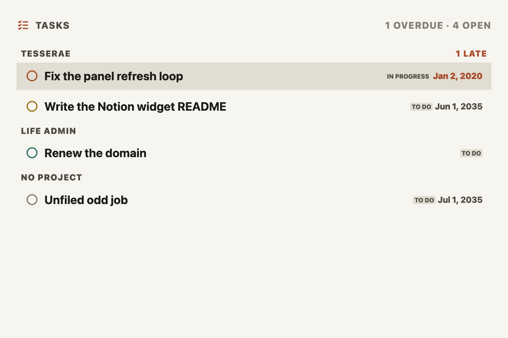
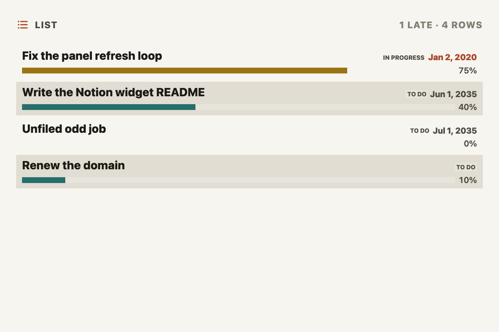
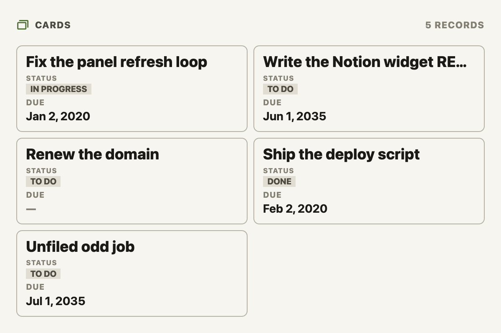
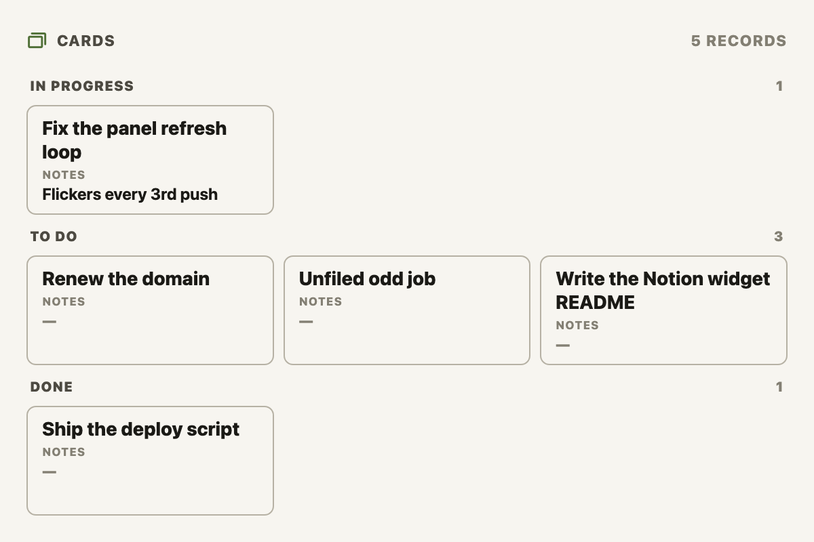

# Notion for Tesserae

Put any Notion database on an e-ink panel.

Three widgets and a shared connection for [Tesserae](https://github.com/dmellok/tesserae),
the self-hosted e-ink dashboard server.

## What it does

**Notion, Tasks** — your open tasks, overdue first, with due date, status and
project. Optionally grouped under a heading per project, status or
priority. The one widget here
that assumes what its rows *are*: things to be done.



**Notion, List** — one line per row of any database: title, status, date,
person, and a progress bar where the database tracks one. Completed rows are
left out by default.



**Notion, Cards** — a grid of bordered cards, one per record, showing up to
five columns of your choosing. How each column is drawn follows its Notion
type: a checkbox as a checkbox, a select or status as a badge, a date as a
date, anything else as text. Each column gets its own size and can show its
name. Filter by up to three column conditions, sort by any column, group
under a heading per value of a column, cap the count.





**You don't have to reshape your Notion databases to use these.** Tasks and
List work out which column holds the status, the date, the priority and the
project by looking at column *types*, not names — so a title column called
"Task", a status called "Stage" and a date called "Whenever" are all found.
Anything your database doesn't have is simply left out. Cards asks you to
name the columns, and draws each one the way its type suggests.

## Getting started

Five minutes, and three of them are in Notion.

**1. Create an integration.** Go to
[notion.so/my-integrations](https://www.notion.so/my-integrations) → *New
integration*. Name it, pick your workspace, and copy the token — it starts
with `ntn_`. Read access is all these widgets ever use.

**2. Share your databases with it.** This is the step everyone misses. Open a
database in Notion → **•••** (top right) → **Connections** → add your
integration. Do this for every database you want on a panel.

> A database you haven't shared simply won't appear, and Notion gives no error
> saying why — the API genuinely cannot see it.

**3. Add the token to Tesserae.** Go to **Widgets → Notion Core → admin page**,
give the account a name (anything you like — "Work", "Personal"), paste the
token, and Save. The page then lists every database it can see.

**4. Add a widget.** On a dashboard, add a *Notion, Tasks*, *Notion, List* or
*Notion, Cards* cell and pick your database from the **Database** dropdown.
Tasks and List detect the columns for you; Cards shows the title column until
you name the columns you want.

## Configuration

Account setup lives on the **Notion Core admin page**. Everything else is
per-cell, in the normal widget options.

### Options every widget has

| Option | Default | What it does |
|---|---|---|
| **Database** | — | Which Notion database to read. Required. |
| **Title** | per widget | Heading shown on the cell. |
| **Refresh** | 15 min | How often to re-query Notion. |
| **Sort by column** | blank | A Notion column name. Blank keeps the widget's own order (see below). A select, multi-select or status column sorts in the order its options are arranged in Notion (drag them in the column's settings), the same order a view grouped by it shows. Rows with nothing in that column go last either way. |
| **Sort direction** | Ascending | |
| **Then sort by column** | blank | Breaks ties in the first sort. Same rules. |
| **Then sort direction** | Ascending | |
| **Only show items for** | — | Filter to one person. Blank shows everything. See [Showing only your own items](#showing-only-your-own-items). |
| **Filter columns** | auto | Which columns the person filter looks at. Blank = the people column. |

### Notion, Tasks

| Option | Default | What it does |
|---|---|---|
| **Max tasks shown** | 8 | Upper bound; smaller cells show fewer. |
| **Group by** | No grouping | `Project`, `Status` or `Priority` buckets tasks under a heading per value of that column, using the detected column or the one the matching **… column** option names. Tasks with nothing in the column go last, under *No project* / *No status* / *No priority*. |
| **Show group headings** | on | Off keeps the grouping and ordering but drops the heading rows; each row then shows its own project name or status chip instead. |
| **Show due dates** | on | |
| **Show project names** | on | |
| **Show status chips** | on | |
| **Include completed tasks** | off | A panel is usually for what's left. |
| **… column** (×5) | auto | Override a detected column. Leave blank unless a guess is wrong. |

Default order: overdue first, then soonest due, then priority, then title.
With a **Sort by column** set, that column decides instead.

Group order: a status or select column's groups come in the order its
options are arranged in Notion, the same order a Notion board grouped by it
shows, whatever the rows are sorted by; sorting by that very column,
descending, reverses them. Otherwise groups follow the first task of each
group when a sort column is set, and the most urgent task in each group when
it is not, so the project needing attention stays at the top.

### Notion, List

| Option | Default | What it does |
|---|---|---|
| **Max rows shown** | 6 | |
| **Show progress bars** | on | Needs a number, formula or rollup column. |
| **Show dates** | on | |
| **Show person** | off | |
| **Include completed rows** | off | A row is "completed" when its status is Done-like or its done checkbox is ticked. |
| **… column** (×5) | auto | Override a detected column. |

Default order: past their date first, then soonest dated, then furthest
along, then title.

### Notion, Cards

| Option | Default | What it does |
|---|---|---|
| **Columns** | 2 | Cards per row. Small cells cap it: 1 at xs, 2 at sm, 4 at md. |
| **Max records shown** | 6 | Rows follow from this and Columns. Every row gets an equal share of the cell, so more records means shorter cards. |
| **Space between properties** | 0 em | Extra white space between one property and the next on every card, 0–5 em, on top of the small gap always there. |
| **Property 1 … 5** | blank | A Notion column name, exactly as spelled. Blank slots are skipped. With none set, cards show the title column. |
| **Property N size** | M | XS, S, M, L or XL. Scales that field's text, badges, checkbox and name together. |
| **Property N max lines** | 1 | For text. 1 keeps it to one line, cut with an ellipsis; more lets it wrap, up to that many lines. A rollup that gathers several values always lists them one per line. |
| **Property N: show field name** | off | Puts the column name above the value (beside it, for a checkbox). |
| **Group by column** | blank | Cards collect under a heading per value, in sorted order; cards with nothing in the column go last under *No &lt;column&gt;*. A column with several values files the card under the first. |
| **Filter 1–3: column** | blank | A column name; blank means that filter is unused. Every filter that names a column must hold. |
| **Filter 1–3: condition** | is | is / is not / is one of / is not one of / contains / does not contain / is empty / is not empty / greater than / at least / less than / at most. |
| **Filter 1–3: value** | — | Matched case-insensitively. *Is one of* takes a comma-separated list (`This Week, Next Week, This Quarter`); a multi-select matches on any of its tags. Dates take `2026-09-30`, a month `2026-09`, or `today`. A checkbox takes `yes` or `no`. |

How a column is drawn:

| Notion type | Drawn as |
|---|---|
| checkbox | a checkbox |
| select, status, multi-select | badges, one per value |
| date, created time, last edited time | a date (with the end date for a range, the time for a datetime) |
| number | a number, in the column's Notion format (`75%`, `$1,200`) |
| formula, rollup | whichever of the above its result is |
| rollup that gathers several values | text, one value per line, flattened and de-duplicated (a rollup over a multi-select lists every tag once) |
| anything else | text (people and relations as names, comma-separated) |

A field that would be sliced off the bottom of a short card is hidden whole
instead, and a cell too short for every row draws fewer whole cards and says
*N OF M* in its title bar. If a field you set is missing, the card is too
short for it — raise the cell size, or lower **Max records shown**, the
field's size or its max lines.

Sort with no column set is Notion's own order.

### Overriding a column

If a guess is wrong, type the Notion property name into the matching *…
column* option — **exactly** as Notion spells it, emoji and all
(`🎬 Episodes`, not `Episodes`). The admin page's **Inspect columns** link
lists every column and what was detected, which is the easiest place to copy
the name from. The same goes for every option that names a column: sort,
filter, and the Cards properties.

Get it wrong and the cell says so and lists the columns that do exist. It will
never silently read a different column instead.

### Showing only your own items

By default a widget shows every row in the database — which on a shared
company database is everybody's work. **Only show items for** narrows it.

Type **`me`**. That means whoever owns the Notion token, and it is the option
to reach for:

- It resolves to your real Notion user, so it survives you being renamed.
- Notion does the filtering, before paging — so it stays correct on a database
  far larger than one page.

Typing your own name works identically. Any *other* person's name still
works, but is matched on the displayed name after fetching (see below).

**Filter columns** picks which columns are checked, comma-separated. A row is
kept if **any** of them matches, which is how you get "mine if I'm the
assignee *or* a collaborator":

```
Only show items for:  me
Filter columns:       Assignee, Collaborators
```

Blank uses the auto-detected people column, so for a database with a single
`Assignee` column you only need to fill in the first field.

Filterable column types: people, select, status, multi-select, title and text.
Naming a date or number column is an error rather than a silent empty list.

> **A filter only finds what's actually filled in.** If nobody is assigned to
> those rows in Notion, filtering by person correctly returns nothing — the
> cell says "Nothing for me" rather than pretending the database is empty.
> Check in Notion that the rows really have a person set, and that you are
> looking at the database you think you are: names like *Tasks* and *To-dos*
> multiply, and only one of them is usually the one you work out of.

> **Get the column names from Notion, not from memory.** *Assignee* is often
> actually *Owner*, *Assign* or *Current owner*, and it differs per database.
> **Inspect columns** on the admin page lists the exact spelling. A name that
> doesn't exist is reported as an error listing the real ones.

> **Some workspaces contain you twice.** If you have both a work and a guest
> account in one workspace, `me` means whichever of them owns the integration
> token — which may not be the identity your colleagues assign work to. The
> admin page shows the resolved owner name; if it isn't the one you expect,
> create the integration from the other account.

### Several Notion accounts

Use **Add another account** on the admin page for a second workspace, or a
second integration on the same one. Each keeps its own name and token.

There's no separate account picker on a cell. The **Database** dropdown lists
every account's databases, prefixed with the account name (`Work · Roadmap`),
and picking one selects that account too — a Notion database belongs to
exactly one workspace, so there's nothing else to choose.

Removing an account erases its token and drops its cached data. Cells pointing
at it fall back to another account rather than breaking.

## Troubleshooting

| What you see | Why | Fix |
|---|---|---|
| Database dropdown is empty | Nothing shared with the integration | Notion → database → ••• → Connections → add it, then **Refresh from Notion** |
| One database missing from the list | Not shared, or the list is cached (1 hour) | Share it, then **Refresh from Notion** |
| *"Notion rejected the integration token"* | Wrong or revoked token | Copy it again from notion.so/my-integrations and re-save |
| *"Notion can't see that database"* | Not shared with **this** account's integration | Share it, or pick a database belonging to an account that can see it |
| *"This database has no column called …"* | Typo in a column name (override, sort, filter or Cards property) | Copy the exact name from **Inspect columns** — emoji included |
| Grouping uses the wrong column | A column added very recently | Self-corrects within 15 minutes; **Refresh from Notion** to force it |
| *"Your stored Notion token can no longer be decrypted"* | `TESSERAE_SECRET_KEY` changed | Re-enter the token on the admin page |
| Everything shows "No project" | The project column is a relation to a database you haven't shared | Share the *related* database too, so its page titles can be read |
| A person filter shows nothing | Those rows have nobody assigned in Notion | Set the person in Notion, or clear the filter |
| *"'X' is a date column, which can't be filtered"* | A non-text column named in **Filter columns** | Use a people, select, status, multi-select, title or text column — or, on Cards, the condition filter, which takes any type |
| A Cards field is missing from some cards | The card is too short for it | Bigger cell, fewer records, or a smaller size for that field |
| A relation shows nothing on a card | The related database isn't shared | Share it with the integration |

## Good to know

**Notion API version.** Built for `Notion-Version: 2025-09-03`, where a
database contains one or more *data sources*. Older versions can't query a
multi-source database. There's an override on the admin page if you ever need
one; leave it blank.

**Multi-valued project columns.** A project column can be a `relation` with
several targets, or a `multi_select` with several tags. A row and a heading
each need one label, so the first entry wins, in Notion's own order.

**What it fetches.** Up to 500 rows per refresh. Sorted by Notion itself when
the sort column is a type Notion can sort (text, number, select, status, date,
checkbox, URL, timestamps), so the 500 are the right 500; other types are
sorted after the fetch. Select, multi-select and status columns sort by the
option order in the cached column layout, so an option you have just added
or moved can take up to 15 minutes to sort into place. Database lists are
cached for an hour, column layouts for 15 minutes, results for your chosen
Refresh interval.

**How person filtering works.** Notion's people filter takes a user *id*, not
a name, and `GET /v1/users` is forbidden to personal access tokens — so a
colleague's name cannot be looked up. What does work is `GET /v1/users/me`,
whose `bot.owner.user` is the human who created the integration. That is how
`me` resolves to a real id and gets filtered by Notion itself. Any other name
is matched locally on the fetched rows, which is exact but only sees the first
500 rows. The Cards condition filter is always applied locally, for the same
reason it works on every column type.

Notion also accepts the literal string `"me"` in a people filter, but there it
means the *integration bot* — never anybody's assignee — so it silently
matches nothing. This widget deliberately does not use it.

**Network and privacy.** `api.notion.com` is the only host these widgets ever
contact, and Tesserae enforces that at the socket layer. Tokens are stored
encrypted and are never sent back to the browser. Nothing is written outside
each plugin's own data directory.

## Development

```sh
python -m pytest -q          # no token or network needed
ruff check .
python shoot.py        # render every widget and size to screenshots/
python shoot.py --theme dark
```

Both need a Tesserae checkout for the app itself; the sibling
`../../tesserae-upstream-fork` is assumed, or set `TESSERAE_SRC`.

Layout: one folder per plugin (the folder name is the plugin id), and
everything else at the root, because the marketplace installer treats every
root-level directory of the bundle as a plugin folder. `notion_core/server.py` holds everything the widgets share on
the server (accounts, discovery, property reading, the person and condition
filters, sorting, the result cache); `notion_core/static/notion-widgets.js`
holds what they share in the browser (escaping, date labels, the error, empty
and count states). A widget's `client.js` imports it relatively, which the
host serves from the core's `static/` folder.

## Status

Pre-1.0, and 0.6 breaks placed cells on purpose: *Notion, Projects* became
*Notion, List* with no shim, its option keys were renamed to match, and the
pre-multi-account single-token setting is no longer read. Re-add the token on
the admin page and re-place any List cells.

Verified against a real Notion workspace: database discovery, column
detection, two accounts side by side, and grouping by an emoji-named
`relation` column. The Cards widget and the sort options are verified against
the fake Notion in the test suite and the headless-Chromium render, not yet
against a live workspace.

## License

MIT — see [LICENSE](LICENSE).

Tesserae itself is AGPL-3.0-or-later, and MIT is compatible with it: combined
into a Tesserae deployment the whole is AGPL, while these files stay reusable
under MIT. Nothing here derives from Tesserae's source; the plugin code
imports only the standard library and Flask.
