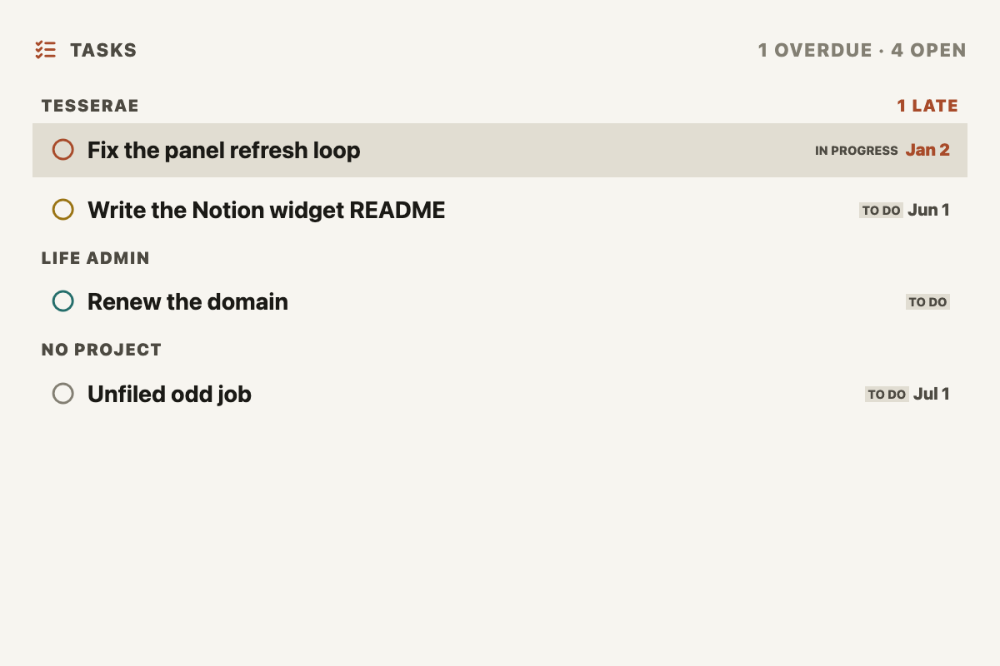
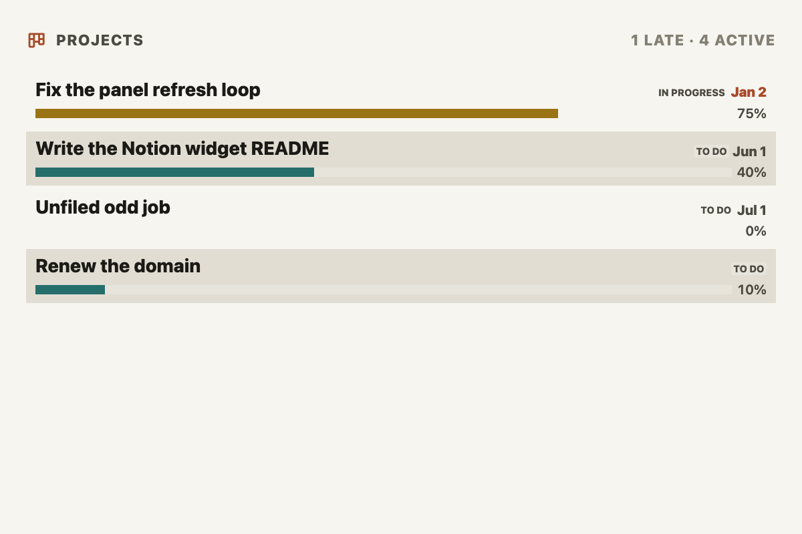

# Notion for Tesserae

Put your Notion tasks and projects on an e-ink panel.

Two widgets and a shared connection for [Tesserae](https://github.com/dmellok/tesserae),
the self-hosted e-ink dashboard server.



## What it does

**Notion, Tasks** — your open tasks, overdue first, with due date, status and
project. Optionally grouped under a heading per project.

**Notion, Projects** — active projects with status, target date, owner, and a
progress bar where your database tracks one.



**You don't have to reshape your Notion databases to use these.** The widgets
work out which column holds the status, the due date, the priority and the
project by looking at column *types*, not names — so a title column called
"Task", a status called "Stage" and a date called "Whenever" are all found.
Anything your database doesn't have is simply left out of the display.

## Getting started

Five minutes, and three of them are in Notion.

**1. Create an integration.** Go to
[notion.so/my-integrations](https://www.notion.so/my-integrations) → *New
integration*. Name it, pick your workspace, and copy the token — it starts
with `ntn_`. Read access is all these widgets ever use.

**2. Share your databases with it.** This is the step everyone misses. Open a
database in Notion → **•••** (top right) → **Connections** → add your
integration. Do this for every database you want on a panel.

> A database you haven't shared simply won't appear, and Notion gives no error
> saying why — the API genuinely cannot see it.

**3. Add the token to Tesserae.** Go to **Widgets → Notion Core → admin page**,
give the account a name (anything you like — "Work", "Personal"), paste the
token, and Save. The page then lists every database it can see.

**4. Add a widget.** On a dashboard, add a *Notion, Tasks* or *Notion,
Projects* cell and pick your database from the **Database** dropdown. That's
it — the columns are detected for you.

## Configuration

Account setup lives on the **Notion Core admin page**. Everything else is
per-cell, in the normal widget options.

### Notion, Tasks

| Option | Default | What it does |
|---|---|---|
| **Database** | — | Which Notion database to read. Required. |
| **Title** | `Tasks` | Heading shown on the cell. |
| **Max tasks shown** | 8 | Upper bound; smaller cells show fewer. |
| **Refresh** | 15 min | How often to re-query Notion. |
| **Group by** | No grouping | `Project` buckets tasks under a heading per project. |
| **Show group headings** | on | Off keeps the grouping and ordering but drops the heading rows; each row then shows its own project name instead. |
| **Show due dates** | on | |
| **Show project names** | on | |
| **Show status chips** | on | |
| **Include completed tasks** | off | A panel is usually for what's left. |
| **… column** (×5) | auto | Override a detected column. Leave blank unless a guess is wrong. |

### Notion, Projects

| Option | Default | What it does |
|---|---|---|
| **Database** | — | Which Notion database to read. Required. |
| **Title** | `Projects` | |
| **Max projects shown** | 6 | |
| **Refresh** | 15 min | |
| **Show progress bars** | on | Needs a number, formula or rollup column. |
| **Show target dates** | on | |
| **Show owner** | off | |
| **Include completed projects** | off | |
| **… column** (×5) | auto | Override a detected column. |

### Overriding a column

If a guess is wrong, type the Notion property name into the matching *…
column* option — **exactly** as Notion spells it, emoji and all
(`🎬 Episodes`, not `Episodes`). The admin page's **Inspect columns** link
lists every column and what was detected, which is the easiest place to copy
the name from.

Get it wrong and the cell says so and lists the columns that do exist. It will
never silently read a different column instead.

### Several Notion accounts

Use **Add another account** on the admin page for a second workspace, or a
second integration on the same one. Each keeps its own name and token.

There's no separate account picker on a cell. The **Database** dropdown lists
every account's databases, prefixed with the account name (`Work · Roadmap`),
and picking one selects that account too — a Notion database belongs to
exactly one workspace, so there's nothing else to choose.

Removing an account erases its token and drops its cached data. Cells pointing
at it fall back to another account rather than breaking.

## Troubleshooting

| What you see | Why | Fix |
|---|---|---|
| Database dropdown is empty | Nothing shared with the integration | Notion → database → ••• → Connections → add it, then **Refresh from Notion** |
| One database missing from the list | Not shared, or the list is cached (1 hour) | Share it, then **Refresh from Notion** |
| *"Notion rejected the integration token"* | Wrong or revoked token | Copy it again from notion.so/my-integrations and re-save |
| *"Notion can't see that database"* | Not shared with **this** account's integration | Share it, or pick a database belonging to an account that can see it |
| *"This database has no column called …"* | Typo in a column override | Copy the exact name from **Inspect columns** — emoji included |
| Grouping uses the wrong column | A column added very recently | Self-corrects within 15 minutes; **Refresh from Notion** to force it |
| *"Your stored Notion token can no longer be decrypted"* | `TESSERAE_SECRET_KEY` changed | Re-enter the token on the admin page |
| Everything shows "No project" | The project column is a relation to a database you haven't shared | Share the *related* database too, so its page titles can be read |

## Good to know

**Notion API version.** Built for `Notion-Version: 2025-09-03`, where a
database contains one or more *data sources*. Older versions can't query a
multi-source database. There's an override on the admin page if you ever need
one; leave it blank.

**Multi-valued project columns.** A project column can be a `relation` with
several targets, or a `multi_select` with several tags. A row and a heading
each need one label, so the first entry wins, in Notion's own order.

**What it fetches.** Up to 500 rows per refresh, sorted by due date where the
database has one. Database lists are cached for an hour, column layouts for
15 minutes, results for your chosen Refresh interval.

**Network and privacy.** `api.notion.com` is the only host these widgets ever
contact, and Tesserae enforces that at the socket layer. Tokens are stored
encrypted and are never sent back to the browser. Nothing is written outside
each plugin's own data directory.

## Development

```sh
python -m pytest -q          # no token or network needed
ruff check .
python tools/shoot.py        # render every widget and size to screenshots/
python tools/shoot.py --theme dark
```

Both need a Tesserae checkout for the app itself; the sibling
`../../tesserae-upstream-fork` is assumed, or set `TESSERAE_SRC`.

## Status

Pre-1.0. Verified against a real Notion workspace: database discovery, column
detection, two accounts side by side, and grouping by an emoji-named
`relation` column.

## License

MIT — see [LICENSE](LICENSE).

Tesserae itself is AGPL-3.0-or-later, and MIT is compatible with it: combined
into a Tesserae deployment the whole is AGPL, while these files stay reusable
under MIT. Nothing here derives from Tesserae's source; the plugin code
imports only the standard library and Flask.
